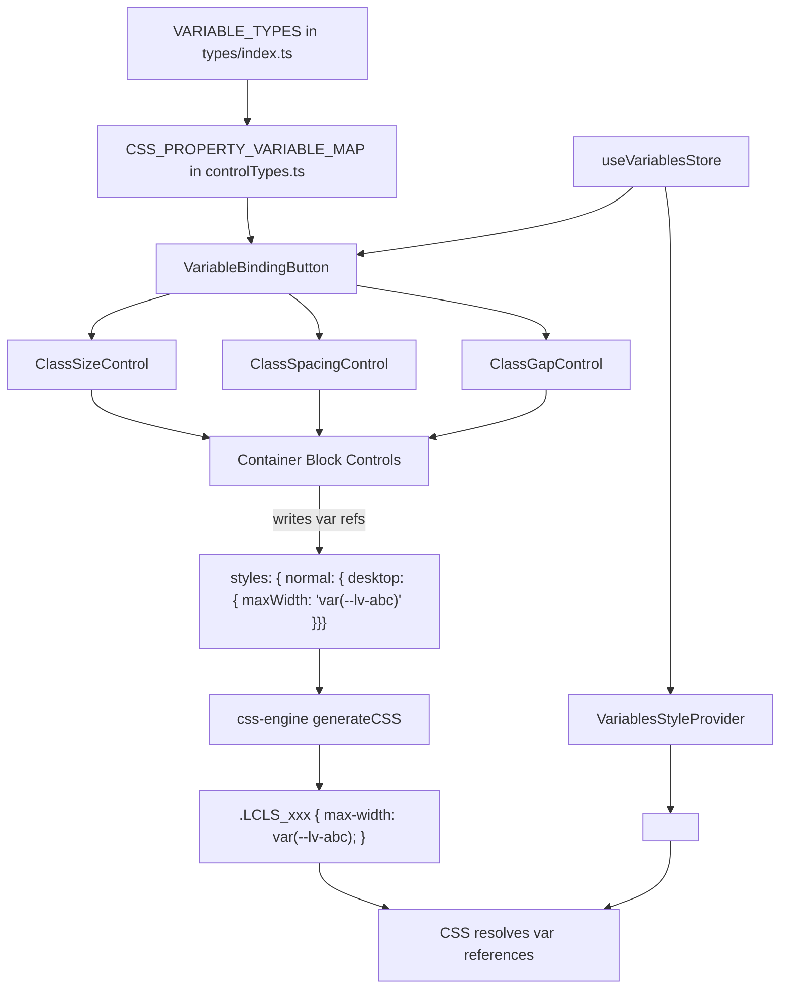

# Variable Binding Integration for Block Controls

Integrate the Variables system with block controls (starting with Container) and the Classes plugin, so each CSS property control can optionally reference a variable instead of a hardcoded value. This ensures design consistency across the site.

## Current Architecture Summary

- **Variables** are stored in `useVariablesStore` with types: `color`, `length`, `box-shadow`, `text-shadow` (extensible via `VARIABLE_TYPES` in `@/types`)
- **Controls** (`ClassSizeControl`, `ClassOptionGroup`, `ClassSpacingControl`, `ClassGapControl`) live in `shared/ClassControls.tsx` and `shared/ResponsiveControls.tsx`
- **Container block** uses these controls to write CSS properties into a `styles` object (`{ [pseudo]: { [breakpoint]: { [cssProp]: value } } }`)
- **Classes plugin** uses `useClassesStore` with the same styles object format
- **CSS engine** (`css-engine.ts`) generates CSS from the styles objects via `generateCSS()`

## Core Concept

Each CSS property value can be either:
1. **A literal value** (e.g., `"16px"`, `"#ff0000"`) — current behavior
2. **A variable reference** (e.g., `"var(--lv-primary-color)"`) — new behavior

When a control is bound to a variable, the stored value becomes a CSS `var()` reference. The CSS engine already outputs raw values, so `var(--lv-primary-color)` will flow through naturally. The variable definitions themselves must be emitted as CSS custom properties on `:root` (or a wrapper element).

---

## Proposed Changes

### 1. Centralized Control Type Registry

> [!IMPORTANT]
> This is the key architectural piece. We define a single source of truth mapping CSS properties to their compatible variable types.

#### [NEW] [controlTypes.ts](file:///home/me/code/lokin-puck-astro/src/components/client/website/pages/editor/puck/blocks/shared/controlTypes.ts)

A centralized registry that maps CSS properties to their compatible variable types. No hardcoding in individual controls.

```ts
import { type VariableType } from "@/types";

/**
 * Maps each CSS property to the variable type(s) that can be bound to it.
 * This is the single source of truth — controls read from this, never hardcode.
 */
export const CSS_PROPERTY_VARIABLE_MAP: Record<string, VariableType[]> = {
  // Color properties → "color" variables
  backgroundColor: ["color"],
  color: ["color"],
  borderColor: ["color"],
  outlineColor: ["color"],
  textDecorationColor: ["color"],
  caretColor: ["color"],
  accentColor: ["color"],
  fill: ["color"],
  stroke: ["color"],
  background: ["color"],  // gradient support

  // Length properties → "length" variables
  width: ["length"],
  height: ["length"],
  minWidth: ["length"],
  maxWidth: ["length"],
  minHeight: ["length"],
  maxHeight: ["length"],
  paddingTop: ["length"],
  paddingRight: ["length"],
  paddingBottom: ["length"],
  paddingLeft: ["length"],
  marginTop: ["length"],
  marginRight: ["length"],
  marginBottom: ["length"],
  marginLeft: ["length"],
  gap: ["length"],
  rowGap: ["length"],
  columnGap: ["length"],
  borderWidth: ["length"],
  borderRadius: ["length"],
  fontSize: ["length"],
  lineHeight: ["length"],
  letterSpacing: ["length"],
  top: ["length"],
  right: ["length"],
  bottom: ["length"],
  left: ["length"],

  // Shadow properties → shadow variables
  boxShadow: ["box-shadow"],
  textShadow: ["text-shadow"],
};

/**
 * Get compatible variable types for a CSS property.
 * Returns empty array if no variables are applicable.
 */
export const getVariableTypesForProperty = (cssProperty: string): VariableType[] => {
  return CSS_PROPERTY_VARIABLE_MAP[cssProperty] || [];
};

/**
 * Check if a value is a variable reference
 */
export const isVariableRef = (value: string): boolean => {
  return typeof value === "string" && value.startsWith("var(--lv-");
};

/**
 * Extract variable ID from a var() reference
 * Format: var(--lv-{variableId})
 */
export const parseVariableRef = (value: string): string | null => {
  const match = value.match(/^var\(--lv-(.+)\)$/);
  return match ? match[1] : null;
};

/**
 * Create a CSS var() reference from a variable ID
 */
export const createVariableRef = (variableId: string): string => {
  return `var(--lv-${variableId})`;
};
```

---

### 2. Variable Binding Toggle Component

#### [NEW] [VariableBindingButton.tsx](file:///home/me/code/lokin-puck-astro/src/components/client/website/pages/editor/puck/blocks/shared/VariableBindingButton.tsx)

A small icon button that appears next to any compatible control. When clicked, opens a dropdown showing available variables filtered by the compatible type(s). When a variable is selected, the control's value is replaced with a `var()` reference.

**Key behaviors:**
- Shows a subtle "variable" icon (`mdi:variable`) next to compatible controls
- When bound: icon becomes active (highlighted), shows variable name as tooltip
- Click opens a filtered picker showing only variables of compatible type(s)
- "Unbind" option to return to literal value
- Reads variable data from `useVariablesStore` (already available via Zustand)

```tsx
// Props:
{
  cssProperty: string;              // e.g. "maxWidth", "backgroundColor"
  value: string;                    // current value (could be var() or literal)
  onChange: (val: string) => void;  // callback to update the style value
}
```

**Implementation notes:**
- Uses `getVariableTypesForProperty(cssProperty)` from the registry to determine which types to show
- Filters `useVariablesStore.variables` by those types
- When bound to a variable, stores `var(--lv-{variableId})` as the value
- When unbound, reverts to the variable's current resolved value (or empty)
- Only renders the button if the CSS property has compatible variable types

---

### 3. Wrap Existing Controls with Variable Binding

#### [MODIFY] [ClassControls.tsx](file:///home/me/code/lokin-puck-astro/src/components/client/website/pages/editor/puck/blocks/shared/ClassControls.tsx)

Add an optional `cssProperty` prop to each control. When provided:
- The `VariableBindingButton` appears in the control's label row
- If the value is a `var()` reference, the numeric/slider input shows the variable name instead and is non-interactive (read-only display) with an "unbind" option

**Changes per control:**

| Control | New `cssProperty` prop | Behavior when bound |
|---------|----------------------|-------------------|
| `ClassSizeControl` | e.g. `"maxWidth"` | Slider disabled, shows `var(--lv-...)` badge |
| `ClassSpacingControl` | Maps edges: `"paddingTop"`, etc. | Each edge gets own binding button |
| `ClassGapControl` | `"rowGap"`, `"columnGap"` | Each axis gets own binding button |
| `ClassOptionGroup` | N/A for now (enum values like flex-direction aren't variable-bindable) | No change |

**For spacing/gap controls with multiple sub-properties:** Each EdgeInput/GapInput gets its own small variable binding button. The binding is per-property, not per-group.

---

### 4. Update Container Block to Pass CSS Property Names

#### [MODIFY] [Container.tsx](file:///home/me/code/lokin-puck-astro/src/components/client/website/pages/editor/puck/blocks/Container/Container.tsx)

Pass the `cssProperty` prop to each control so the variable binding button knows which CSS property it controls:

```tsx
<ClassSizeControl
  label={...}
  value={current.maxWidth}
  cssProperty="maxWidth"  // NEW
  onChange={(val) => handleUpdate({ maxWidth: val })}
  ...
/>

<ClassSpacingControl
  label={...}
  type="padding"
  cssProperties={{  // NEW: map edges to CSS props
    top: "paddingTop",
    right: "paddingRight",
    bottom: "paddingBottom",
    left: "paddingLeft",
  }}
  ...
/>
```

---

### 5. Emit Variable Definitions as CSS Custom Properties

#### [MODIFY] [css-engine.ts](file:///home/me/code/lokin-puck-astro/src/components/client/website/pages/editor/core/css-engine.ts)

Add a new function `generateVariablesCSS()` that emits all variables as CSS custom properties:

```ts
export const generateVariablesCSS = (variables: Variable[]): string => {
  const lightVars = variables.filter(v => v.mode === "Light" && !v.is_group);
  const darkVars = variables.filter(v => v.mode === "Dark" && !v.is_group);

  let css = `:root {\n`;
  lightVars.forEach(v => {
    css += `  --lv-${v.id}: ${v.value};\n`;
  });
  css += `}\n`;

  if (darkVars.length > 0) {
    css += `@media (prefers-color-scheme: dark) {\n  :root {\n`;
    darkVars.forEach(v => {
      css += `    --lv-${v.id}: ${v.value};\n`;
    });
    css += `  }\n}\n`;
  }

  return css;
};
```

#### [MODIFY] Container render function

Inject the variables CSS alongside the block CSS so `var()` references resolve correctly in the editor preview.

---

### 6. Integrate Variables into Classes Plugin

#### [MODIFY] [Classes.tsx](file:///home/me/code/lokin-puck-astro/src/components/client/website/pages/editor/puck/plugins/Classes.tsx)

When editing a class's styles (which happens in the Container's inline controls via the ClassChips→activeClass flow), the same controls with variable binding are already used. **No direct changes needed to Classes.tsx** — the integration happens at the control level.

However, we should add a visual indicator in the Classes panel showing which classes use variables:
- Add a small badge/icon on class items that reference variables in their styles
- This helps users understand which classes are "dynamic"

> [!NOTE]
> The Classes plugin itself doesn't directly manage styles — it provides the classes list. Style editing happens through the block controls (Container.tsx) when a class chip is active. So the variable binding automatically works for classes too via the shared controls.

---

### 7. Variable CSS Injection in Editor Preview

#### [MODIFY] Container render (or a new top-level wrapper)

The variables CSS (`--lv-{id}: value`) must be available in the editor iframe for preview to work. Options:

**Recommended: Inject via a `<VariablesStyleProvider>` component** that reads from `useVariablesStore` and injects a `<style>` tag with all CSS custom properties. This should be rendered once at the editor root level (not per-block).

#### [NEW] [VariablesStyleProvider.tsx](file:///home/me/code/lokin-puck-astro/src/components/client/website/pages/editor/puck/blocks/shared/VariablesStyleProvider.tsx)

A component that subscribes to `useVariablesStore` and renders a single `<style>` tag with all variable definitions. Should be mounted in the editor's iframe/preview wrapper.

---

## Architecture Diagram



## User Review Required

> [!IMPORTANT]
> **Naming convention for CSS custom properties**: I propose `--lv-{variableId}` (where `lv` = Lokin Variable). The variable ID is a UUID, so names will look like `var(--lv-a1b2c3d4-...)`. An alternative is using a slugified variable name like `--lv-primary-color`, but that creates name collision risks. Which do you prefer?

> [!IMPORTANT]  
> **Scope of initial implementation**: The plan starts with Container block only. Other blocks (Text, Hero, etc.) will follow the same pattern — just add `cssProperty` props to their controls. Should I include those in this plan or keep them as follow-up?

> [!WARNING]
> **Variable value resolution in the editor**: When a control is bound to a variable, the slider/number input can't show the "resolved" numeric value because `var()` can't be parsed to a number client-side. The control will show a "bound to variable" badge instead. Is this acceptable UX?

## Open Questions

1. **Should variable bindings persist across modes?** If a control is bound to `var(--lv-primary-color)`, and the user switches from Light to Dark mode, the `var()` reference stays the same but the CSS custom property value changes. This is probably the desired behavior (that's the whole point), but want to confirm.

2. **Mount `VariablesStyleProvider`** inside the editor iframe to affect the preview using override iframe https://puckeditor.com/docs/api-reference/overrides/iframe

3. `ClassOptionGroup` (for display, direction, wrap etc.) These are enum-type values, not suitable for current variable types. I've excluded them for now.